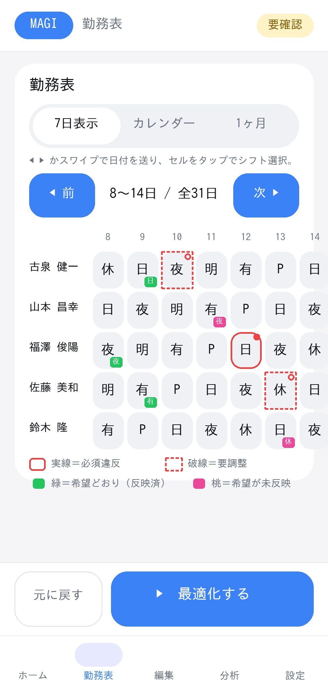
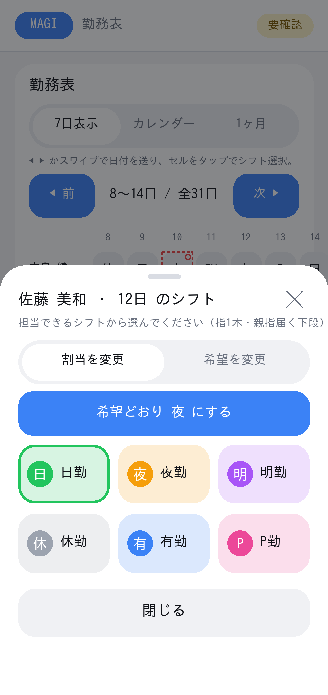

# MAGI 画面仕様書（画像付き）

本書は MAGI（純Kotlin / Jetpack Compose / Material3）の**全画面・主要ポップアップ・メッセージ**を、
実トークン（`MainActivity.kt` の色・角丸・タイポ）で描いたモック画像とともに定義する。

- 図はトークン正確モック（実機スクショではない）。再生成: `python3 tools/mock_render_dogfood.py`（出力 `docs/screens/`、PDFは `tools/magi_dogfood.pdf`）。
- 設計トークン・コンポーネントAPIの正典は [`magi_design_system.md`](magi_design_system.md)。本書は「画面ごとの目的・オブジェクト・メッセージ・指1本操作」を定義する。
- 運用フロー: **初期解の生成 → 手動修正 → 最適化**（人事課マネージャー／リーダーの運用）。
- 共通: 上部 `TopBar`（MAGIバッジ＋状態チップ 配布可/要確認/実行中）、下部 `コマンドバー`（元に戻す＋主要アクション）＋`ナビ`（ホーム/勤務表/編集/分析/設定）。タップ標的は最小48dp。
- **Web版との対応・操作差**は次節にまとめ、各画面に「**Web対応**」注記を付す（権威版 `magi_v6_web.html` v5.33.19 と比較）。
- 主要な「未実装・部分実装」項目は実装完了済み。残る低優先タスクは本書末尾「今後の検討」に集約。
- **本書の反映バージョン**: app **v3.35**（編集タブ=3サブタブ[今月の調整／シフト希望／基本マスター]・基本マスターは5節に集約・**分析タブに一般/プロ切替＋違反内訳18/18=100%(fair追加)**・**全ポップアップ統一[`DialogHeader`タイトル＋右上✕／共有3ボタンで確定=右・取消=左・48dp・危険⚠]**・全ダイアログ縦スクロール・コンポーネント別CSV取込/スタッフupsert・氏名照合の空白無視・グループ削除の自動再割当・編集の自動保存＋背景即時flush・設定タブの冗長除去＋見出し体裁の統一）。
  - **v3.8→v3.35 のUI差分**: ①編集タブ再設計（月次/年次マスターの2分割→**今月の調整／シフト希望／基本マスター**の3分割、年次の7節→**5節に統合**）。②分析タブに **一般/プロ** 切替を追加し、熟練者向けプロ表示では冗長な説明文を非表示。違反内訳に **fair（公平化のズレ）** を加えて全18種を表示（17/18→**18/18**）。③ポップアップ全種（ダイアログ／フォーム／ボトムシート／ピッカー／確認）を統一：ヘッダーは `DialogHeader`、ボタンは共有3部品で**確定=右・取消=左**を固定、最低48dp、破壊的操作は**⚠＋エラー色**。色設定の左右逆ボタンを是正。

---

## 画面一覧

| # | 画面 | 種別 | 図 |
|---|---|---|---|
| 00 | 未読込（EmptyState） | 状態 | `screens/06_empty.png` |
| 01 | ホーム | タブ | `screens/01_home.png` |
| 02 | ホーム 実行中 | 状態 | `screens/07_home_running.png` |
| 03 | 勤務表 7日 | タブ | `screens/02_schedule7.png` |
| 04 | シフト選択シート | ポップアップ | `screens/03_picker.png` |
| 05 | カレンダー 月表示 | タブ内モード | `screens/04_calendar.png` |
| 06 | 勤務表 1ヶ月マトリクス | タブ内モード | `screens/08_month_matrix.png` |
| 07 | 編集 | タブ | `screens/09_edit.png` |
| 08 | 分析 | タブ | `screens/10_analysis.png` |
| 09 | 設定 | タブ | `screens/11_settings.png` |
| 10 | 希望反映の確認ダイアログ | メッセージ | `screens/05_dialog.png` |
| 11 | 中断復帰バナー | メッセージ | `screens/12_interrupted.png` |

---

## Web版との対応・操作差

権威版 `magi_v6_web.html`（v5.33.19）は **ExcelライクなワークシートUI**（各 ws は rows×cols のグリッドをセル単位で直接編集／下部8タブ）。本ネイティブは **カード/ボトムシートのモバイルUI**（下部5タブ）。設計哲学が異なるため、画面・操作の対応は次のとおり。

### 画面マッピング（Web ws → Native）
| Web ワークシート | 役割（Web） | Native の対応 |
|---|---|---|
| ws1 ①基本情報 | スタッフ・シフト・グループの基本マスター | 編集タブ＋設定（マスター系エディタ） |
| ws3 ②希望シフト | 希望シフト入力（グリッド） | 編集タブ `WishEditor` / `WishApplyCard` |
| ws2 ③必要人数 | 日別必要人数＋簡易作成結果 | 編集タブ `NeedDayEditor`／ホームの「作成」 |
| ws6 ④勤務表（作成結果） | 最適化結果（**読取専用**） | 勤務表タブ（読取/編集を分けない単一表）🟡 |
| ws7 ⑤編集中シフト | **手動修正→再最適化の起点** | 同・勤務表タブのセル直接編集 🟡 |
| ws4 ⑥制約ルール（年次） | 禁止連続・ペア禁止等 | 編集タブ `ConstraintEditor` |
| ws5 ⑦個人別の回数（年次） | 個人別回数の上下限 | 編集タブ `StaffRangeEditor` |
| 詳細設定（FlagsView） | OPT_PARAMS 等の実験フラグ | 「最適化設定」に時間/並列/方式/研磨を集約。実験フラグ群は意図的に非公開（旧 FlagsView は v3.8 で撤去） |

### 主要オブジェクトの操作差
| 領域 | Web版 | Native版 |
|---|---|---|
| セル編集 | グリッドセルをクリックして**値を入力/選択**（Excel式） | tap→**ShiftPickerSheet**で担当可シフトのタイル選択（自由入力不可・誤値防止）＋触覚 |
| 結果/編集中 | **ws6(読取)とws7(編集)を別シートで分離** | 単一の勤務表タブで直接編集（**分離なし＝差分**） |
| 表示切替 | シート切替＋横スクロール | `MagiSegmentedControl`（7日/カレンダー/1ヶ月）＋スワイプ |
| 希望反映 | 「そのまま反映」 | `WishApplyCard`：担当外は**確認ダイアログ→反映＋Undo＋操作ログ** |
| 年次/月次 | **タブで明示分離**（「制度変更時のみ」） | 編集タブで**月次/年次マスターを分離**（年次=7折りたたみ節。07b） |
| 実行 | 上部「シフト最適化」／「翌月のシフトを作成」 | **下部コマンドバー固定**＋**背景実行(WorkManager)** |
| 進捗 | BusyOverlay（反復中心）＋**TapGame**（ミニゲーム） | `CopilotCard`（満足度/残時間/未解決）＋赤「計算を止める」。TapGameは**非採用** |
| タイムアウト | **20分**（`stagTimeoutMin:20`） | **10分上限**（業務指示） |
| 詳細フラグ | 「詳細設定」タブで広く公開 | 簡素化（上級フラグ非公開） |
| 入出力 | 💾保存/CSV出力（ブラウザDL） | **OSファイルピッカー(SAF)**＋ログ出力 |

### Native のみ（Webに無い操作）
ボトムシート選択編集・触覚・スワイプ・片手モード・テーマ4種・**背景最適化＋完了通知＋kill復帰バナー**・**月カレンダー**・**非色手がかり(HARD実線/SOFT破線)**・**covU原因診断**・**HF63配線**・**文字化け自動修復**・クイックアクションタイル・操作監査ログ。

### Web のみ（Native 未対応＝残課題）
- 🟡 **ws6/ws7（結果/編集中）の明示分離** … 勤務表タブに「結果(読取)／編集中」モードの追加が候補。
- ✅ **年次マスター**（⑥制約ルール・⑦個人別回数）… 編集タブ「年次マスター」に実装済み（07b）。
- ⬜ **詳細設定（OPT_PARAMS フラグ）の公開** … 操作者向けは「計算方式」プリセットに集約し、生フラグは**意図的に非公開**。
- ⬜ TapGame・翌月作成バナー・フッター変更履歴（意図的に非採用 or 低優先）。

---

## 07b. 編集タブ：今月の調整／シフト希望／基本マスターの3分割

- **目的**: 毎月変える項目（必要人数・希望）と、たまにしか触らない基本マスター（基本情報・制約・個人回数）を分け、**誤編集を防ぐ**。Web版の月次/年次ウィザード分離をモバイル流に反映し、希望を独立サブタブへ昇格。
- **構成**: `MagiSegmentedControl(['今月の調整','シフト希望','基本マスター'])`（`MagiApp.kt` の `editScope` 0/1/2）。
  - **今月の調整**(0) = `MonthPickerCard`（対象月）＋`NeedDayCard`（日別必要人数）。
  - **シフト希望**(1) = `MonthPickerCard`＋`WishCard`（ws3 のセル単位の希望。割当とは別レイヤ）。
  - **基本マスター**(2) = 注意帯（「制度・人員が変わったときだけ編集」）＋**5つの折りたたみ節**(`CollapsibleSection`)。各節は先頭に平易な一文(`SectionNote`)を持ち、`rememberSaveable` で開閉状態を保持して縦長を畳む。
    - **① シフト・グループ・スタッフ**(`Ws1Card`：種類の追加・編集・削除。既定で展開)
    - **② スキルグループ**(`SkillGroupCard`：似た技能のまとめ)
    - **③ 回数（1人あたり）**★統合 = `AptCard`（目標＝やわらかい・groupShiftApt）＋`StaffRangeCard`（個人の下限/上限）＋`GroupRangeCard`（グループ一括の下限/上限＝ws5共有・既存個人値はスキップ保持）
    - **④ 人数と組み合わせ**★統合 = `ConstraintsCard`（グループ単位：C41 1日の人数・C42 禁止ペア）＋`SkillConstraintsCard`（スキル単位：C41s/C42s）
    - **⑤ 並び・くり返し** = `ConstraintsCard`（cons1/2/3/3n/3m/3mn：並び・窓）
- **ラベル混同防止**: サブタブ「シフト希望」(ws3＝勤務の希望) と ⑤ 内の cons3系(ws4＝並びパターン) を区別するため、cons3m を**「並び希望」**、cons3mn を**「並び回避」**と表記（cons3=「必須の並び」/cons3n=「禁止の並び」）。
- **マスター編集操作(`Ws1Editor`)**: シフト/グループ/スタッフの追加・編集・削除（いずれも2件以上で削除可）。**グループ削除は所属者がいても可**（所属者は先頭グループへ自動移動）。**目標回数(`groupShiftApt`)の一括リセット**ボタンあり。制約も含め編集はすべて**自動保存＋「元に戻す」対象**（後述）。
- **新規データ作成時**は基本マスター(editScope=2)へ誘導（`EmptyStateCard` の新規導線）。

## 00. 未読込（EmptyState）


- **目的**: データ未読込時に、最初の一歩（読込/サンプル）へ迷わず誘導する。
- **主要オブジェクト**: 見出し「勤務表を読み込みましょう」、`JSONを開く`(primary 56dp)、`サンプルを試す`(outline 56dp)。
- **メッセージ**: 「JSONを開くか、サンプルで試せます。」
- **指1本**: 大ボタン2つを画面中央〜下に縦積み。OSファイルピッカー（SAF）を起動。
- **実装**: `EmptyStateCard`（`MagiApp.kt`）。状態チップ=未読込。

## 01. ホーム


- **目的**: 「配れるか・どこが問題か・次に何をするか」を一画面で提示。
- **思考誘導カード（最上部・operator_ux §3）**: `OperatorNextActionCard`。いまの状態で文言・色・大ボタンが自動で変わる：未作成→「② 勤務表をつくる」／組立中→「あと約N分・閉じても大丈夫（やめる）」／配れる(緑)→「そのまま配れます（印刷・書き出し）」／もう少し(黄)→「○月○日が人手不足です（なおすのを手伝って／もう一度つくる）」／埋められない(赤)→「ここは埋められません（データを見直す／そのまま配る）」。**大ボタンは常に1つ**＋控えめな補助1つ。数字は言葉つき（人手が足りない日／できあがり度）。専門記号は出さない。
- **主要オブジェクト**: `OperatorNextActionCard`（次の一手）、`StatusHero`（状態見出し＋充足/不足/必要）、`操作アシスト`（満足度）、`人員不足の原因`（充足不可/充足可能を `MagiTagChip` で明示）、下部 `最適化する`。
- **メッセージ**: 「あと一息です／必須の人員不足が N 件。最適化で解消を試せます。」
- **指1本**: 主要CTAは思考誘導カードの大ボタン＋下部コマンドバー固定（親指ゾーン）。
- **冗長性削減（QA）**: ホームは思考誘導カードを主役に整理。`StatusHero`（状態の三重表示）・`SummaryCard`（統計は「ようす」と重複＋開発用語 2世代カバレッジ/初期HARD等）・`QuickActionGrid`（下部ナビと4/6重複）を**除去**。`CopilotCard` は できあがり度バー/進捗の重複を外し**助言・警告だけ**に。`ActionCard` は主操作を外し**「ほかの作り方（速く/かんたん）＋閉じても続ける」**に縮小。下部CTA「勤務表をつくる」は思考誘導カードと**同一動作（本最適化）に統一**（同名ラベル別動作の不整合を解消）。
- **実装**: `OperatorNextActionCard`/`CopilotCard`(助言)/`CoverageDiagnosisCard`/`ActionCard`(ほかの作り方)/`AlternativesCard`。詳細統計は「ようす(分析)」タブへ集約。

## 02. ホーム 実行中


- **目的**: 計算中の進捗を可視化し、安心して待てる/止められる状態にする。
- **主要オブジェクト**: 状態チップ=実行中（青）、スピナー＋「残り約 N 秒 ・ 未解決 ・ 反復」、進捗バー、下部 `■ 計算を止める`（赤）。
- **メッセージ**: 「途中で閉じても入力は自動保存されます」「5つの仮説を並列探索中（W0..W4）」。
- **途中経過ライブ表示（DefragLiveView 移植）**: 実行中、思考誘導カードの下に折りたたみ「🔬 途中経過を見る（組んでいる様子）」。最良盤面を節目（ALNS 120反復毎・RSI ラウンド毎）でストリームし、職員×日の極小色セルで描画、**前回からの変化セルを赤枠**でハイライト（読取専用）。オペレーターに「コンピューターが組んでいる様子」を見せて安心させる。`V6NativeOptimizer.liveBest`→`UiState.liveSchedule`→`LiveScheduleCard`。
- **最適化中ログ（強化）**: 実行中も**操作ログにマイルストーンを逐次追記**する。記録するのは (1) 探索フェーズの遷移（例「探索フェーズ: ALNS restart 1/2（12秒経過）」）と (2) **必須違反が減った瞬間**（例「必須違反 残り2件 に改善（18秒・合計31）」）のみ。両者とも**スロットル**（フェーズ≥2.5秒・必須改善≥1.5秒間隔、必須0到達時は即記録）でスパムを防ぐ。完了時に最終サマリ（必須/合計/フェーズ/所要ms）。
- **停滞脱出戦略の自律選択（MagiConductor 移植）**: SA再加熱境界で、直近の最良未更新反復数が一定（既定3000）を超えたら、UCB1多腕バンディットで脱出戦略 {Reheat（最良へ戻し再加熱）/ StrongPerturb（最良から数手摂動して離す）/ ScaleTemp（現在解から再加熱）} を自律選択し、効果（最良が改善したか）を報酬としてオンライン学習する。停滞前は NoOp＝従来の reset-to-best 再加熱で挙動不変。Web版 com.magi の MagiConductor を忠実移植（`MagiConductor`／`SaParams.conductor`）。
- **Guided Local Search（GLS 移植）**: ALNS探索で、停滞時（最良未更新が既定200反復超）に違反セルのうち util=寄与/(1+penalty) 最大の割当を penalty+1 し、accept-worse（探索）判定に `lambda*Σpenalty` を加えて局所最適から遠ざける。改善手は従来どおり生スコアで受理し、グローバル最良も生スコアで別管理するため**GLSで真の最良を失わない**。Web版 ALNS の penalty[i][j][k] を移植（`GlsPenalty`／`V6NativeOptimizer.runAlns`）。
- **役割分担による並列仮説の多様化（HF289/HF290 移植）**: 最大5並列の仮説に、探索/精製の温度・摂動プロファイルを割り当てて多様化（W0=1.0＝従来のベースライン、W1=探索(高温×2)、W2=精製(低温×0.5)、W3=探索1.6、W4=精製0.6）。最良採用なので**役割分担が裏目でも W0 が現状を保証＝退化しない**。`V6OptimizerOptions.explore`（SAの初期温度・ALNSの受理温度/再スタート摂動に作用）。三賢人(SAGE)人格モードは専用フラグ＋未実装の重み体系のため見送り。
- **平準化研磨（二次目的・退化なし）**: 主目的(hard→total→weighted)を悪化させない範囲で、被覆を保つ同日スワップにより (a) **グループ内シフト回数の平準化**（群ごと・担当ONシフトの分散最小化）と (b) **7日周期(曜日)の平準化**（各職員の勤務を曜日7バケットで均す）を厳密に下げる。スコア体系は不変（ゴールデン不変）。`V6HotfixPasses.applyGroupShiftEqualizePolish` / `applyWeeklyEqualizePolish`。
- **ソフト研磨の連続規則(C3/C3m/C3n/C3mn)特化＝2-3日連結スワップ**: c3(必須)/c3m(推奨)/c3mn(回避)/**c3n(禁止=HARD)** はいずれも職員の**連続日の並び**。同日スワップ(循環交換)は1日しか変えられず多日パターンに届かないため、**2職員が連続 W日(W=2,3)を丸ごと交換**（各日の人数＝被覆不変・HARD維持）する移動を追加。W日パターンが入れ替わり2〜3日の並びを直す。実目的関数で評価し改善時のみ採用（keep-best）。isBetter は HARD 最優先のため **c3n(禁止=HARD)** の解消も同時に拾う。`V6HotfixPasses.applyC3SequencePolish`。
- **ソフト研磨の期間要件(C1)特化**: c1（cons1＝D日窓にシフトXをN回以上・**職員ごと**）は実機ログでも大きいSOFT（c1=25〜114）。c1不足の (職員,窓) に的を絞り、その窓内の非X日に**Xをしている提供者と同日スワップ**（被覆不変＝HARD維持）して不足職員のXを増やす。実目的関数で評価し改善時のみ採用（keep-best）。汎用循環交換より c1 を効率的に削る。`V6HotfixPasses.applyC1WindowPolish`。
- **ソフト研磨の循環交換(VLSN・T2)**: 実機ログ上、残存SOFTの大半は **c3/c3m（連続規則）**。日内Hungarianは range/apt 中心で c3 に効かないため、**被覆を保つ循環交換（k=2 スワップ / k=3 ローテーション、同日・人数不変＝HARD維持）** を追加。各サイクルを**実目的関数(UnifiedViolationChecker)で評価し改善時のみ採用**（keep-best＝退化なし、サイクル生成が不完全でも悪化しない）。`V6HotfixPasses.applyCyclicSwapPolish`。
- **ソフト研磨の厳密化：日ごと最小費用割当（ZSDD検証の結論）**: ZSDD等の知識コンパイルは月次の列(人数)・回数・平準化の結合で木幅が高く不適合（検証済み）。代わりに後処理(`runPostOptimization`)へ **日ごと厳密割当** を追加：各日の (日,シフト) 人数=HARD充足を固定し、希望未固定の職員を同一シフト集合へ「個人別回数(range)・適切回数(apt)の逸脱が最小」に Hungarian で**厳密再割当**。乱択でなく日内最適の候補を作り、全体が改善した日だけ採用（keep-best＝退化なし）。連続規則/希望/平準化は採用判定で担保。`MinCostAssignment`／`V6HotfixPasses.applyDayAssignmentPolish`。
- **エリート再結合：Path Relinking（論文活用・品質向上）**: 並列ポートフォリオが保持する精鋭解(`lastAlternatives`)と現行最良を**再結合**し、両者の中間にある——どの単独軌道でも届かない——良解を拾う（Glover, Laguna & Martí 2000 / Scatter Search）。現行最良を起点に各精鋭解へ強制マーチ（差分セルを順次適用、違反セルを前倒し）し、経路上の最良中間解を採用。**現行最良起点＝退化しない（best-of-best）**。早期停止で空いた予算の一部(≤15%・15〜60s)だけを使い5分は超えない。頭打ちした同種探索でなく「別種の探索」に時間を充てて品質を底上げ。`V6NativeOptimizer.elitePathRelink`／`V6FinalPort.handleOptimize`。
- **受理戦略の多様化：Great Deluge（論文活用）**: 並列仮説の一部(W2,W4)の ALNS 受理を **時間予定型 Great Deluge**（Dueck 1993／Burke, Bykov, Newall & Petrovic 2004）にして、SA(Boltzmann)とは異なる受理軌道で探索を多様化。水位は開始スコアから best へ線形降下し「候補スコア ≤ 水位（かつ必須非悪化）」で受理。W0,W1,W3 は従来SAのまま＝**best-of-N＋ベースラインで退化なし**。`AcceptMode`／`greatDelugeLevel`／`V6NativeOptimizer.runAlns`。
- **停滞早期脱出**: 進捗ストリームの「最良解(必須→合計→重み付き)」更新時刻を監視し、**一定時間(stallMs＝予算の1/4・最短25秒, 10分予算なら約150秒)改善が無ければ予算上限を待たず終了**する。フェーズ遷移でもタイマをリセットするので各フェーズに必ず猶予がある。**改善が続く限り絶対に止めない＝品質は不変**。データ上 HARD=0 にできない／研磨が頭打ちの局面で「常に10分かかる（=ハングに見える）」を解消。発火時は診断ログに `[I] EarlyStop 停滞検知…` を残す。
- **指1本**: 停止は赤の大ボタンで明確化。バックグラウンド実行へ切替も可。
- **実装**: `running=true` 時の `CopilotCard` 進捗＋コマンドバー差し替え。停滞監視は `V6FinalPort.handleOptimize` のウォッチドッグ（`shouldStop`）→ `V6NativeOptimizer.optimize`／`SaOptimizer`（`SaParams.shouldStop`）へ協調停止を伝播（解の最良値は各フェーズが保持して返す）。

## 03. 勤務表 7日（手動修正の主画面）


- **目的**: 初期解を見ながら、セル単位で手早く直す。
- **主要オブジェクト**: 表示切替 `MagiSegmentedControl`(7日/カレンダー/1ヶ月)、前/次（48dp）、職員×7日グリッド、**違反凡例 `ViolationLegend`**。
- **1つのセルに表示される情報（重ねて最大5層）**: ①**背景色**＝シフト色 ②中央の**シフト記号**（空欄＝未割当）③**違反枠**（HARD実線/SOFT破線）④**違反ドット**右上（HARD塗り/SOFT中空リング・11dp）⑤**希望バッジ**右下（緑＝反映済/桃＝未反映、中に**希望の記号**を白文字）。読み上げ＝「シフト{記号}・{必須違反/要調整}・希望{記号}(反映済/未反映)、タップで変更」。
- **違反表示（非色手がかり）**: HARD=**実線枠＋塗りドット** / SOFT=**破線枠＋中空リングドット**（色覚多様性・モノクロ印刷対応）。凡例「実線＝必須違反 / 破線＝要調整」。違反種別の意味・重み・場所の一覧は §08b。
- **希望シフトの表示（割当との融合）**: **7日表示のセル（`Cell`）**で、各セルの**右下に希望の小バッジ**を重ねて表示。**緑＝反映済（割当＝希望）／桃＝未反映（割当≠希望）**、バッジ内に**希望の記号**を白文字。希望が登録されていないセルにはバッジを出さない。読み上げにも「・希望{記号}（反映済/未反映）」を付与。1ヶ月マトリクス・カレンダーは高密度のため希望バッジは出さない（違反のみ枠で示す。後述§05/§06）。これにより7日表示では「割当」と「希望」を1枚で同時把握でき、未反映（桃）が一目で分かる。
- **指1本**: セルtap→シフト選択シート、左右スワイプで日付送り、触覚フィードバック。
- **表示／非表示トグル**: ①**凡例の開閉**（「凡例（色・記号の意味）▸ / 凡例を隠す ▾」＝実線/破線の意味＋シフト色キー。**既定は畳む**＝暗記済み前提）②**表示モード かんたん⇄プロ**（設定＞外観 ＆ 分析タブの一般/プロ＝**共有状態**。プロは勤務表が**1ヶ月俯瞰**既定＋列の一括選択、冗長説明を非表示、数値診断を前面）③**重大のみ**（分析＞違反の内訳で HARD のみに絞る）④**テーマ 自動/明/暗/UD**・**片手モード**（設定＞外観）。⑤（参考）7日/カレンダー/1ヶ月はビュー切替。**※希望バッジと違反表示は常時表示でトグル消去不可**（消せるのは凡例とプロ表示時の冗長説明のみ）。
- **Web対応（残課題）**: Web は **ws6「勤務表（作成結果・読取専用）」と ws7「編集中シフト（手動修正→再最適化の起点）」を別シートで分離**。Native は**単一の勤務表タブで直接編集**（読取/編集の明示分離なし）。→ 候補: 本タブに「結果(読取)／編集中」モード切替を追加して Web 運用に寄せる 🟡。違反表示は Web の色のみに対し Native は**非色手がかり(実線/破線)＋凡例**を追加。
- **実装**: `ScheduleGrid`/`Cell`（`wishSym`/`wishMet` で右下バッジ）/`violationBorder`/`isHardCellViolation`。

## 04. シフト選択シート（手動修正の主操作）


- **目的**: タップしたセルのシフトを、担当可能な候補から選ぶ。
- **主要オブジェクト**: `ModalBottomSheet`、**統一ヘッダー `DialogHeader`（タイトル「○○ ・ N日」＋右上の閉じる✕）**、**担当可シフトの大タイル（色＋記号＋『○勤』）**、選択中は枠強調。閉じるはヘッダーの✕／枠外タップ（no-drag方針：ドラッグ不要で明示的に閉じられる）。
- **メッセージ**: 「担当できるシフトから選んでください（指1本・親指届く下段）」。
- **割当／希望の2モード**: ヘッダー直下のトグル「割当を変更／希望を変更」(`mode`)で、同じシートから**割当**と**希望**の両方を編集できる。
  - **凝縮ステータス**: トグル付近に現在の割当＋希望（「希望 未登録」／「希望 {記号}（反映済/未反映）」、未反映は桃色）。
  - **割当モード**: タップで割当を即変更。候補タイルに**結果プレビュー注記**（現在／希望／不足解消／超過）。希望が未反映なら最上部に**「希望どおり {記号} にする」1タップボタン**（最頻操作を1手に）。
  - **希望モード**: タップで希望を登録/変更（即確定・触覚）。**「外」＝担当外も登録可**（配置で違反になる旨を明示）。登録済みなら**「希望を削除（希望なし）」**。
- **指1本**: タイルは56dp・下段集約。**割当モードは担当外を出さず誤割当を構造的に防ぐ**（希望モードのみ「外」を登録可）。
- **Web対応**: Web は ws6/ws7 のグリッドセルに**直接値入力**（Excel式）。Native は**担当可候補からの選択式**にして誤値を構造的に防止。
- **実装**: `ShiftPickerSheet`（`mode` 割当/希望・`setWish`/`removeWish`・「希望どおり」即適用）／`allowedShiftsFor`／`setCell`。シフト色は**16色の識別しやすいパレット**を勤務シフトへ割当（休=スレート）、似たシフトが同色に潰れないよう調整（`resolveShiftColor`、未設定時の既定）。

## 05. カレンダー 月表示（問題日の発見）


- **目的**: 月全体を俯瞰し、薄い日（不足）を素早く見つける。7日表示が「編集」、本ビューは「月の俯瞰＝発見」。
- **主要オブジェクト**: **週列（月〜日）の月グリッド**。曜日見出し（土=青/日=赤）。各日セルは**日番号＋「その日に多いシフト」の色ピル**（`ShiftEventPill`＝記号＋人数）を数件。**不足日は赤枠＋赤ドット**で強調。
- **表示単位は「日」**: セル単位の割当・希望・違反詳細は出さない（それらは7日表示／1ヶ月マトリクス）。本ビューは日ごとの充足/不足の発見に専念。
- **指1本**: 日付tapでその日を含む週の7日表示へジャンプ（page=日/7 に移動し gridMode=0）。
- **実装**: `ScheduleGrid`(gridMode==1)→`MagiCalendarMonthView`/`DayShiftCell`/`ShiftEventPill`。

## 06. 勤務表 1ヶ月マトリクス


- **目的**: 職員×全日をシフト色で一望し、偏り/穴を面で確認。
- **主要オブジェクト**: 職員行×全日列の**極小色セル**（高さ約20dp・背景＝シフト色・記号を小さく重ねる）。**違反は枠**（HARD＝実線/SOFT＝破線、`violationBorder`）。
- **セルの表示情報（高密度＝2層）**: ①背景色＝シフト色 ②違反枠（HARD実線/SOFT破線）。**7日表示の5層のうち、違反ドットと希望バッジは省略**（高密度のため。詳細は7日表示で確認）。違反フィルタ「重大のみ」と連動（隠した種別は枠も出さない）。
- **プロ表示の一括編集**: かんたん＝列/セルのタップでその週の7日表示へ。**プロ＝セルを複数タップで選択 → シフトをタップで一括設定**（選択は `proSel` キー集合 i*100000+j）。多人数・多日をまとめて直せる。
- **指1本**: 横スクロール不要（画面幅に圧縮）。タップ操作のみ（ドラッグ不要）。
- **実装**: `ScheduleGrid` の 1ヶ月モード（gridMode==2）。7日の `Cell` とは別の高密度 `Box` 描画（だから希望バッジ/ドットを持たない）。

## 07. 編集（希望の反映と一括操作）


> 図は編集タブの「基本マスター」サブタブ（タブ全体の構成は §07b）。

- **目的**: 登録した希望シフトを勤務表へ反映し、担当外希望を安全に扱う。タブ全体の3サブタブ構成は §07b。
- **希望の反映（`WishApplyCard`）**: 編集タブ**上部**に表示（**下書き/編集中のときだけ**。読取専用の結果には適用不可なので非表示）。希望のうち担当可能分を勤務表へ反映する大ボタン＋**担当外 N 件は反映されない旨（赤）**。反映は確認ダイアログ(#10)＋Undo。
- **希望の一括操作**: 「希望シフトの一括操作（曜日／全体）」→ボトムシート(`WishBulkSheet`)で曜日・全体まとめて希望を設定/消去。
- **3サブタブ（詳細は §07b）**: 反映カードの下に `MagiSegmentedControl`「今月の調整／シフト希望／基本マスター」。図はその「基本マスター」（5節）。
- **指1本**: 反映は確認＋Undo。ボタンは48dp以上。
- **Web対応**: Web は ws3（希望グリッド）入力＋「そのまま反映」。Native は担当外を**確認ダイアログ＋Undo＋操作ログ**で安全化。基本マスター(ws4 制約／ws5 個人回数)も編集タブ「基本マスター」に実装済み（`ConstraintEditor`/`StaffRangeEditor` ほか。§07b 参照）。
- **実装**: `WishApplyCard`（`effectiveEditing` 時のみ）／`WishBulkSheet`／3サブタブは `editScope`（0/1/2）。

## 08. 分析（一般/プロ切替・ようす・チェック概要・違反の内訳18/18）


- **目的**: 配布可否の根拠を数値で示す。
- **主要オブジェクト**: 上部に **一般/プロ** 切替(`MagiSegmentedControl`→`proMode`)。以下を縦に表示：`OverviewDashboard`（ようす＝俯瞰）／`CheckSummaryView`（チェック概要＝守れていない約束の件数）／`BreakdownCard`（違反の内訳）／`BottleneckCard`（しわ寄せの集中箇所）／`FixSuggestionCard`（違反を減らす1手提案・「変更」＝1マス別勤務／「交換」＝2人の同日入替）。`重大のみ`フィルタ。**プロ時のみ** `V6DashboardCard`＋`WeightTableCard` を上段に追加。
- **違反の内訳は全18種=100%**: 必須群（groupViol/pref/covU/c3n）＋人数の範囲群（low/high/apt）＋任意群（c1/c2/c3/c3m/c3mn/c41/c42/c41s/c42s/covO/**fair**）。直近で **fair（公平化のズレ）** を任意群に追加し 17/18→**18/18** に。fair はセル単位の場所を持たないため、内訳チップのタップ時は「場所情報がありません」（ペナルティ量は表示）。**各18種の意味・重み・違反箇所の出し方は §08b にまとめた。**
- **一般/プロの差**: プロ表示は熟練者向けに**冗長な説明文を非表示**（概要のサブ文・内訳の注記「数値はペナルティの大きさ…」・群名の括弧（満たすべき/できれば）・ボトルネックの注釈・改善提案の変更/交換の説明）。**構造的不足ヒント**（「※1手で直せない違反は設定(ws1)の見直しが根本解」）・状態表示・実データ（件数/場所/提案）は**常時表示**。
- **指1本**: スクロールのみで全体把握。各項目は読み取り専用（内訳チップのタップで該当セルへ）。
- **【ドッグフーディング校正 2026-06-13】**: 開発用の **`ColorSettingsView`**（英語名＋生の制約コード c1/c3n/covU ＋ WARN/CRITICAL 露出）と **`FlagsView`**（実験フラグ）を**分析タブから除外**し、**設定＞詳細設定（上級者/開発者向け）へ移設**（#10）。分析タブは「数値で配布可否を判断」に専念。
- **実装**: `OverviewDashboard`／`CheckSummaryView`／`BreakdownCard`（`breakdownLabels`/`BreakdownGroup`）／`BottleneckCard`／`FixSuggestionCard`。違反の正準集合は `MirrorKeys.all`（18種）。5カードは `proMode` を受け取り条件分岐。プロ専用は `V6DashboardCard`／`WeightTableCard`。

## 08b. 制約・違反の種類（全18種：C1〜C42・回数・被覆・公平ほか）

分析タブ「違反の内訳」(`BreakdownCard`)・勤務表のセル表示・改善の提案が共通で扱う**違反の正準集合は18種**（`MirrorKeys.all`）。各違反は**重み**(`MirrorKeys.weights`＝単一の真実)で `weightedScore` に加算される。**HARD＝守るべき約束**（重みが桁違いに大きい）、**SOFT＝できれば**。HARD が1つでも残ると「配れない」。

### HARD（守るべき約束・4種）
| キー | 表示名 | 重み | 場所 | 意味 |
|---|---|---|---|---|
| `groupViol` | グループ不整合 | 10000 | セル | グループ制約に反する配置 |
| `pref` | 希望違反 | 9000 | セル | 登録された希望シフトが満たされない |
| `covU` | 人員不足 | 8000 | 日付 | その日のシフトの必要人数に足りない（被覆不足） |
| `c3n` | 禁止の並び | 7000 | セル | 禁止された勤務の並び（cons3n／FORBIDDEN） |

### SOFT（できれば・14種）※重み降順
| キー | 表示名 | 重み | 場所 | 意味 |
|---|---|---|---|---|
| `low` | 下限割れ | 90 | 回数 | 個人の回数が下限(ws5)を下回る |
| `high` | 上限超過 | 45 | 回数 | 個人の回数が上限(ws5)を超える |
| `c3mn` | 回避の並び | 12 | セル | 避けたい勤務の並び（cons3mn／編集名「並び回避」） |
| `c1` | 窓の要件 | 4 | セル | 一定期間（窓）内の要件（cons1） |
| `c3` | 必須の並び | 3 | セル | 望ましい勤務の並び（cons3）※Androidでは SOFT 扱い |
| `c3m` | 推奨の並び | 2 | セル | 推奨の勤務の並び（cons3m／編集名「並び希望」） |
| `c2` | 個人の合計 | 1 | 回数 | 個人の合計回数の要件（cons2） |
| `c41` | 群のレンジ | 1 | 日付 | 1日あたりの群の人数レンジ（C41） |
| `c42` | 群ペア | 1 | セル | 同日共存を禁じる群ペア（C42） |
| `c41s` | スキル群のレンジ | 1 | 日付 | スキル群の人数レンジ（C41s） |
| `c42s` | スキル群ペア | 1 | セル | スキル群の禁止ペア（C42s） |
| `apt` | 適切回数のズレ | 1 | （無し） | 目標回数(ws1 C／groupShiftApt)とのズレ |
| `fair` | 公平化のズレ | 1 | （無し） | 職員間の偏り（公平性） |
| `covO` | 過剰な配置 | 0.5 | 日付 | 必要人数を超える配置（被覆超過） |

### 違反箇所（場所）の出し方（`breakdownLocations`）
場所は3系統で算出し、内訳チップのタップで一覧へ飛べる：
- **セル系**（c1/c3/c3n/c3m/c3mn/c42/c42s/pref/groupViol）＝`violationCells`(i,j)。**勤務表のセル枠/ドットで直接可視化**：HARD＝実線枠＋塗りドット／SOFT＝破線枠＋中空リング（**ドットは7日表示の `Cell` のみ。1ヶ月マトリクスは枠のみ・カレンダーは日別の不足表示**）。チップタップは「スタッフ名 日付」。
- **回数系**（low/high/c2）＝`countViolations`(i,k)。チップタップは「スタッフ名「シフト」」。
- **被覆系**（covU/covO/c41/c41s）＝`needViolations`(k,j)。チップタップは「日付「シフト」」。
- **場所なし**（apt/fair）＝セル単位の位置を持たないため、タップ時は「場所情報がありません」（ペナルティ量のみ表示）。

### 注意
- **ws3（希望シフト）≠ cons3系**：ws3 は勤務そのものの希望（pref として評価）。cons3系（c3/c3n/c3m/c3mn）は ws4 の**並びパターン**で別物。
- **c3系のラベル差**：内訳は「推奨の並び/回避の並び」、編集ダイアログは「並び希望/並び回避」（同一制約 c3m/c3mn の表示違い）。
- 重みは `MirrorKeys.weights`（挿入順＝加算順）が唯一の真実で、分析タブの重み表(プロ)も同マップを描画して最適化器とのドリフトを防ぐ。

## 09. 設定（時間/並列・通知/片手・外観・データ・詳細設定）


- **目的**: 計算パラメータ・通知・外観・データ入出力を一括管理。**開発/上級向けは折りたたみで隔離**。**設定の操作は重複させない**（同一設定を複数カードに置かない）。
- **主要オブジェクト**: 外観(`AppearanceCard`：自動/明/暗/UD・片手モード・かんたん/プロ)、**最適化設定(`SettingsCard`)＝並列ワーカー・時間予算・計算方式(おまかせ/高速/…)・仕上げ最適化・バージョン表示**、データ(`DataActionsCard`：JSON開く/保存・問題チェック・CSV取込/出力・コンポーネント別出力)。
- **冗長除去（v3.8）**: ①**計算方式＋仕上げ最適化**は旧 `FlagsView`（詳細設定内・生ラベル）と「最適化設定」に二重にあった → **FlagsView を撤去し「最適化設定」に一本化**。②**診断ログ**は旧 `OperatorLogView`（見出し「操作ログ」だが中身は診断ログ＝**誤ラベル**）と詳細設定 `LogsCard` に二重 → **OperatorLogView を撤去**しログは詳細設定>ログ（操作＋診断＋出力）に一本化。③カード見出しを `titleMedium` に統一（最適化設定/ログ を 外観/データ と揃える）。※ `ShiftColorCard`(シフト色) と `ColorSettingsView`(違反色) は別物で**非冗長**。
- **詳細設定（上級者/開発者向け・折りたたみ・既定は閉）**: ↓ 別画面（#12）に集約。**1ヶ月の俯瞰(生指標)＋ログ＋違反色トークン**のみ。
  - **1ヶ月の俯瞰（生指標）** … `V6DashboardCard`。各シフトの需給・負荷プロフィール等の開発用ダッシュボード。
  - **ログ** … 操作ログ・診断ログの**表示**＋**テキスト/JSON出力**（`LogsCard`）。
  - **違反色トークン（参照）** … `ColorSettingsView`。違反種別×重大度の色凡例（開発参照。一般運用では不要）。
  - ※ 実験フラグ（OPT_PARAMS：reheat/destroy/LAHC/三体重み 等）は**UIに公開していない**（操作者向けは「計算方式」のプリセットに集約）。
- **指1本**: スライダー/スイッチ/2列ボタンはいずれも48dp以上。詳細設定の開閉はヘッダ行タップ。
- **Web対応**: Web は独立「詳細設定」タブ(FlagsView)で広く公開。Native は**通常設定は簡素・詳細は折りたたみで隔離**（誤操作と画面の汚れを防ぐ）。入出力は Web の💾/CSV-DL に対し Native は**OSファイルピッカー(SAF)**。
- **CSV取込（強化）**: 取込時に**文字コードを自動判定**（妥当な UTF-8 はそのまま／不正なら CP932(Shift-JIS) として復号。日本の Excel 由来CSVの文字化けを解消）。さらに**病院などの「勤務表テンプレCSV」を新規データとして丸ごと取込**（`RosterCsvImport`）。**固定セル対応**：年月タイトル→期間、グループ名＝**C2/C13**（ユニット見出し）、氏名＝**C4:C11/C15:C22**、勤務記号＝本表**E4:AI11/E15:AI22**（31日）、シフト記号＝凡例**B25:B40**（時刻はC列＝表示名）。**必要人数(need1/need2)はこのCSVに存在せず取り込まない**（凡例の日別数値は現在表の人数集計＝需要ではないため、休/有の人数も含む）。担当可否は不明のため全シフト可で取り込み、後から調整可。
  - **取り込み方法の選択（ダイアログ）**: テンプレ検出時に「**勤務表として**／**希望シフトとして**」を選ばせる（`importRosterAs`）。**勤務表**＝本表セルを初期割り当てに（空セル＝公休）。**希望シフト**＝埋まっているセルを `wishes` に取り込み、勤務表は空（全公休）から開始して最適化で希望を尊重（空セル＝希望なし／元の明示「休」＝希望休として区別）。
  - テンプレでなく既存データがある場合は従来どおり**勤務表だけを重ねる**取込に振り分ける（`importCsvSmart`）。
  - **コンポーネント別の取込/出力**: データ全体だけでなく、**スタッフ一覧／希望シフト／各制約／勤務表**を種別選択して個別に取込・出力できる（`StaffCsvIO`/`WishesCsvIO`/`ConstraintsCsvIO`）。**スタッフ一覧は upsert**＝既存氏名は所属群/スキルを更新、未知の氏名は**新規スタッフとして追加**（勤務表に休の行を追加）。
  - **氏名照合は空白無視**: 「山本 昌幸」(空白あり)と「山本昌幸」(空白なし)を同一人物として扱い、外部CSVの取込で1人分しか入らない事故を防ぐ（`nameMatchKey`）。先頭 **BOM(U+FEFF)も除去**。
  - **取込ミスの診断**: 希望/制約として取り込もうとしたCSVが勤務表/ロスター形式だった場合、正しい形式と取込元を案内する（`componentImportMismatchHint`）。
  - **グループ別の適切回数(`groupShiftApt`)はCSVに無い**ため、初期設定エディタ(`Ws1Editor`)に**Web版「グループ別 担当シフトと適切回数」を移植**：担当ONのシフトに −/＋ ステッパーで「1人あたりの期間内目標回数」を設定でき、最適化が各人をその回数へ近づける（空欄＝目標なし）。`Ws1Ops.setGroupApt`/`MagiViewModel.ws1SetGroupApt`。
- **実装**: `AppearanceCard`／`ShiftColorCard`／`DataActionsCard`／`SettingsCard`／**`AdvancedSettingsSection`（折りたたみ）= V6DashboardCard＋LogsCard＋ColorSettingsView を内包**（旧 FlagsView・トップの OperatorLogView は v3.8 で撤去）。見出しは全カード `titleMedium` で統一。

## 12. 詳細設定（上級者/開発者向け・折りたたみ）

- **目的**: 1ヶ月俯瞰(生指標)・ログ・違反色トークンなど**通常運用に不要な開発/上級項目を1か所に隔離**。ドッグフーディングで分析タブへ漏れていた `ColorSettingsView` の正しい置き場。
- **主要オブジェクト**（各セクションは折りたたみヘッダ＋本文）:
  - **1ヶ月の俯瞰（生指標）**: `V6DashboardCard`。各シフトの需給・負荷プロフィール等。
  - **ログ**: 操作ログ/診断ログの一覧（新しい順）＋「テキスト出力」「JSON出力」（SAF）。**診断ログはスパム抑制済み**：RSI/ALNS の各ラウンド・各リスタート・EarlyChain で同種行が大量に出るため、(1) 連続重複行を「`…  ×N`」に畳み、(2) 上限(200行)超過時は頭7割＋尾3割に圧縮し中略行（省略数）を挿入する。**全文が必要な場合は「テキスト/JSON出力」で取得**（出力は非圧縮の生ログ方針）。
  - **違反色トークン（参照）**: `ColorSettingsView`。違反種別×重大度の色凡例（開発確認用）。
- **状態**: 既定は全セクション**閉**。設定タブ最下部に「**詳細設定（上級者向け）**」（丸シェブロン）で開く。
- **指1本**: ヘッダ行タップで開閉（48dp）。出力はSAF。
- **冗長除去（v3.8）**: 旧 `FlagsView`（計算方式＋仕上げ最適化）は「最適化設定」カードと完全重複のため**撤去**（設定は最適化設定に一本化）。実験フラグ(OPT_PARAMS)のスライダー群はもともとUI未公開。
- **実装メモ**: `AdvancedSettingsSection`（折りたたみ）に `V6DashboardCard`/`LogsCard`/`ColorSettingsView` を内包。関数 `FlagsView`/`OperatorLogView` 自体はレガシー `V6RemainingScreens`（未使用）が参照するため残置し、**設定タブからの呼び出しのみ除去**。

## 10. 希望反映の確認ダイアログ（メッセージ）


- **目的**: 破壊的になり得る一括上書きの前に、影響と取り消し可否を明示。
- **主要オブジェクト**: タイトル「希望を反映しますか？」、本文（上書き範囲＋担当外件数＋Undo可）、`キャンセル`／`反映する`。
- **メッセージ**: 「担当外シフトの希望が N 件あり、これらは反映されません」「『元に戻す』で取り消せます」。
- **指1本**: 2ボタン48dp。既定フォーカスは安全側（キャンセル）。
- **実装**: `AlertDialog`（`applyWishes` 経路）。

- **Web版反映（手動修正⇄再最適化ループ向け・Op1/Op2）**: (1) **やり直し(Redo)** を新設（既存30段Undoの相方）。元に戻した直後に下部バーへ「やり直し」を出し、修正→戻す→やり直しを支える。`MagiViewModel.redo`／`canRedo`。 (2) **画面消灯防止(Wake Lock相当)**: 前景最適化中は `keepScreenOn=true`（消灯による計算中断・ライブ表示停止を防止）。`MagiApp` の `LaunchedEffect(ui.running)`。 ※再最適化は常に編集後の `currentSchedule` を種に開始するため、手動修正がそのまま探索の初期解になる（検証済み）。

## 11. 中断復帰バナー（プロセスkill耐性・メッセージ）


- **目的**: 前回計算がOSにkillされても、入力を失わず再開へ導く。
- **主要オブジェクト**: バナー「前回の計算は中断されました」＋本文（入力は自動保存済み）、`もう一度実行`／`閉じる`。
- **メッセージ**: 「前回の計算は完了前に中断されました。入力は自動保存済みです。もう一度実行できます。」
- **指1本**: ワンタップ再実行。表示は一度だけ（自己消去）。
- **実装**: 実行中マーカー `magi_run_marker.json`＋`InterruptedBanner`（`MagiViewModel`/`MagiApp.kt`）。
- **編集の自動保存（取りこぼし防止）**: スタッフ/グループ/シフト/制約などの編集は逐次 `magi_autosave.json` に保存し、再起動時に復元する。さらに**バックグラウンド遷移(ON_STOP/ON_PAUSE)で即時保存**(`saveNow`)するため、デバウンス保存(1.2秒)の最中にOSがプロセスを破棄しても編集を失わない。**制約編集も保存対象**（旧版では制約編集だけ自動保存されず、バックグラウンドで消える不具合があり修正済み）。`MagiApp` のライフサイクル監視＋`MagiViewModel.saveNow`。
- **[#4] 前景サービス化＋途中結果スナップショット（Android堅牢化）**: バックグラウンド最適化(`OptimizationWorker`)を **`setForeground` で前景サービス化**し、5分のCPUジョブをOSに止めさせない（FGS不可環境は通常実行へフォールバック）。実行中は**約8秒ごとに途中最良解を `magi_bg_best.json` へスナップショット**。次回起動で中断検知かつスナップショットあり→**「途中結果から再開」**（最良盤面を復元、バナー文言も切替）。完了/破棄で各ファイル削除。マニフェストに `FOREGROUND_SERVICE` / `FOREGROUND_SERVICE_DATA_SYNC`。※実機での前景サービス挙動は要デバイス検証（CIはコンパイルのみ）。

---

## A. 実装基盤（他AIが本アプリを再現するための詳細）

本章は画面挙動（§00–§12）を実装へ落とす土台。**色・余白・字・角丸・サイズの具体値と共通コンポーネントAPIは同梱の `magi_design_system.md` §2–§4 が正典**（本書と併読が前提）。本章はそれに加え再現に不可欠な「アプリ構造／データモデル／キー規約／永続化」を定義する。スタック＝Android（単一Activity・Jetpack Compose・Material3・Kotlin・MVVM／`MagiViewModel`）。

### A.1 アプリシェルとナビゲーション
- **構成**: 最上部 `MagiTopBar`（ロゴ＋状態チップ＝未読込／実行中(青)／配布可(緑)／要確認(黄)）、本文、最下部に **コマンドバー** `BottomCommandBar`（主操作「最適化する」＋控えめな補助1つ。**実行中は「■ 計算を止める」(赤)** に差し替え）と **5タブ** `MagiBottomNav`（**ホーム / 勤務表 / 編集 / 分析 / 設定** ＝ tab 0..4）。
- **画面間で共有する状態（`rememberSaveable`）**: `tab`(0–4)、`proMode`(false=かんたん/true=プロ。外観と分析で共有)、`editScope`(0=今月の調整/1=シフト希望/2=基本マスター)、勤務表内 `gridMode`(0=7日/1=カレンダー/2=1ヶ月。proMode時は2が既定)。
- **テーマ**: `themeMode`=自動/明/暗/UD。`oneHand`(片手モード)で内容を下方寄せ。タップ最小48dp。

### A.2 データモデル（＝JSON入出力スキーマ）
ドメイン状態 `MagiState`（`model/MagiState.kt`）がそのままJSONへ往復（未対応キーは `extras` に保持しロスレス）。

**MagiState（ドメイン・入力）**
| フィールド | 型 | 意味 |
|---|---|---|
| `startDate`,`endDate` | String | 期間（曜日整列に使用） |
| `shifts` | List\<Shift\> | 勤務種類 |
| `groups` | List\<Group\> | ユニット（担当可否・covUに使用） |
| `staff` | List\<Staff\> | 職員 |
| `use2Patterns` | Bool | 平日/休日など2系統の必要人数を使うか |
| `groupShift` | List\<List\<Int\>\> | 群×シフトの担当可否(0/1) |
| `groupShiftApt` | List\<List\<String\>\> | 群×シフトの「1人あたり目標回数」(空=なし) |
| `schedule` | List\<List\<Int\>\> | `schedule[i][j]`＝職員i・日jの**シフトidx**（<0＝未割当/公休） |
| `wishes` | Map\<String,Int\> | 希望。キー `"i,j"`→シフトidx |
| `staffRange` | Map\<String,Range\> | 個人別回数の下限上限。キー `"i,k"`(職員i・シフトk) |
| `needDay1`,`needDay2` | Map\<String,String\> | 日別必要人数（系統1/2） |
| `cons1`..`cons42` | List\<CxRow\> | 制約（下記サブ型） |
| `skillGroups`,`cons41s`,`cons42s` | … | スキルグループ（第2分類）とそのC41/C42 |
| `shiftColors` | Map\<String,String\> | シフト記号→"#rrggbb"（表示のみ。`"__vio__"`=違反色） |

**サブ型**
- `Shift(name, kigou, need1, need2)` … 表示名・記号・必要人数(系統1/2)
- `Group(name, kigou)` ／ `Staff(name, groupIdx, skillIdx)`（groupIdx=ユニット＝担当可否、skillIdx=スキル群＝C41s/C42s専用）／ `Range(lo, hi)`
- `C1Row(day1, shiftKigou, day2)` … day1日窓でシフトを day2 回以上（窓要件・職員ごと）
- `C2Row(shiftKigou, count)` … 個人の合計回数
- `C3Row(pattern: List<String>)` … 並びパターン（cons3=必須/cons3n=禁止/cons3m=推奨/cons3mn=回避で同型）
- `C41Row(groupKigou, shiftKigou, l, u)` … 群のシフトを1日 [l,u] 人
- `C42Row(g1Kigou, g2Kigou, s1Kigou, s2Kigou)` … 群g1のs1と群g2のs2は同日併存不可

**UiState（UI・表示用、`ui/MagiUiState.kt`）**: ドメインから導出した表示集約。主なもの＝`loaded/running/hasResult`、`bestHard/bestSoft/weightedScore/totalViolations`、`breakdown`(18種→件数)、`violationCells`(キー`"i,j"`)／`needViolations`(`"k,j"`)／`countViolations`(`"i,k"`)→各説明文、`schedule/wishes/resultSchedule/liveSchedule`、`shiftSymbols/shiftColorHex/shiftTextHex/staffNames/staffGroupSymbols`、`fixSuggestions`(変更/交換の1手)、`satisfaction/copilotHint/coverageDiag/settingIssues`、`logs/opLog`、`canUndo/canRedo/workers/budgetSec/softPolish/v6Algorithm`。

**キー規約（重要）**: セル＝`"i,j"`（i=職員index, j=日index, 0始まり）／回数＝`"i,k"`（k=シフトindex）／被覆＝`"k,j"`。`schedule[i][j]` のシフトidx `<0` は未割当（公休）。希望バッジは `wishes["i,j"]` と `schedule[i][j]` の一致で 反映済(緑)/未反映(桃) を判定（§03）。

### A.3 デザイントークン（具体値・インライン）
完全版と派生は `magi_design_system.md`。本節だけでも組めるよう主要値を再掲。色は Material3 ColorScheme（システム文字サイズ・ダーク/UDに追従）。
- **意味色（ライト）**: background `#F5F5F7`／surface `#FFFFFF`／surfaceVariant `#F0F1F4`／outline `#D9DCE3`／onSurface `#111318`／onSurfaceVariant `#6B7280`／**primary（CTA・実行中＝青）`#3B82F6`**／**tertiary（成功・配布可＝緑）`#22C55E`**／**error（重大違反＝赤）`#EF4444`**。
- **意味色（ダーク）**: background `#111318`／surface `#1B1D22`／primary `#60A5FA`／tertiary `#4ADE80`／error `#F87171`。**UD（高コントラスト, mode=3）**＝白地＋`#000`境界の独立スキーム。
- **アクセント／シフト既定色**: blue `#3B82F6`(早番)／green `#22C55E`(日勤)／orange `#F59E0B`(夜勤)／purple `#A855F7`(遅番)／**pink `#EC4899`(希望・未反映バッジ)**／red `#EF4444`(違反)／gray `#9CA3AF`(休)。シフト色は未設定時この既定、`shiftColors[kigou]→"#rrggbb"` で上書き可。
- **角丸(dp)**: extraSmall12／small16／**medium20＝カード**／**large24＝タイル**／extraLarge28／チップ・ピル＝円形。
- **余白(dp・4グリッド)**: xs4／sm8／md12／**lg16＝カード内標準**／xl20／**section20＝カード間**／**screenH16＝画面左右**。
- **タイポ(sp)**: headlineSmall 24Bold(画面タイトル)／titleLarge 20SemiBold(節)／**titleMedium 17SemiBold(カード見出し)**／bodyLarge16・Medium15・Small13／labelLarge15・Medium13／**大数値 displaySmall 34**(特に強調は `fontSize=44.sp`)。
- **寸法**: タップ最小**48dp**・リスト行**56dp**・シフトタイル**56dp**・カレンダー日セル**64dp**。主操作は下部固定・横スクロール禁止・色＋形の二重符号化。
- **共通部品API**: `MagiSegmentedControl`／`MagiTagChip`／`MagiListRow`／`CollapsibleSection`／`SectionNote`／**`DialogHeader`＋3ダイアログボタン（§4.14：確定=右/取消=左/危険⚠・48dp）**（詳細は design_system §4）。

### A.4 最適化・制約評価（正典：§02・§08b）
- **違反18種・重み・違反箇所**＝§08b（`MirrorKeys.weights` が唯一の真実、`weightedScore` に加算。HARD=守るべき約束／SOFT=できれば）。
- **探索**＝§02：最大5並列の仮説（役割分担で多様化・**最良採用で退化なし**）、SA＋ALNS＋GLS＋Tabu＋Path Relinking＋Great Deluge、停滞脱出はUCB1多腕バンディット、**早期停止**（予算1/4の停滞で終了）、**keep-best 研磨**（C1窓/C3連結スワップ・日内Hungarian・平準化）。前景サービス＋約8秒スナップショットで中断耐性。

### A.5 永続化・入出力
- **自動保存** `magi_autosave.json`（編集を逐次・背景遷移ON_STOP/ON_PAUSEで即時flush・制約編集も対象）。**実行マーカー** `magi_run_marker.json`／**背景最良** `magi_bg_best.json`（中断復帰・「途中結果から再開」）。30段Undo＋Redo。
- **I/O**: JSON開く/保存はOSファイルピッカー（SAF）。CSVは文字コード自動判定（妥当UTF-8はそのまま/不正はCP932復号）、勤務表テンプレCSVの丸ごと取込（勤務表/希望を選択）、コンポーネント別取込/出力（スタッフは upsert・氏名照合は空白/先頭BOM無視）。固定セル仕様と詳細は§09。

### A.6 入力JSONの実例（スキーマ確認用・最小）
§A.2 の `MagiState` に対応。職員2名×3シフトの最小例。`schedule[i][j]`＝シフトidx（0=日/1=夜/2=休、`…`は日方向の省略）。キーの index は0始まり。
```json
{
  "startDate": "2026-06-01",
  "endDate": "2026-06-30",
  "use2Patterns": false,
  "shifts": [
    { "name": "日勤", "kigou": "日", "need1": "3", "need2": "" },
    { "name": "夜勤", "kigou": "夜", "need1": "1", "need2": "" },
    { "name": "公休", "kigou": "休", "need1": "0", "need2": "" }
  ],
  "groups": [ { "name": "A病棟", "kigou": "A" } ],
  "staff": [
    { "name": "古泉 健一", "groupIdx": 0, "skillIdx": 0 },
    { "name": "佐藤 美和", "groupIdx": 0, "skillIdx": 0 }
  ],
  "groupShift":    [ [1, 1, 1] ],
  "groupShiftApt": [ ["", "", ""] ],
  "schedule": [
    [0, 1, 2, 0, 0, "…"],
    [2, 0, 0, 1, 2, "…"]
  ],
  "wishes":     { "0,4": 1 },
  "staffRange": { "1,1": { "lo": "4", "hi": "6" } },
  "needDay1": {}, "needDay2": {},
  "cons1":   [ { "day1": "7", "shiftKigou": "夜", "day2": "2" } ],
  "cons2":   [ { "shiftKigou": "夜", "count": "8" } ],
  "cons3":   [ { "pattern": ["夜", "明"] } ],
  "cons3n":  [ { "pattern": ["夜", "日"] } ],
  "cons3m":  [], "cons3mn": [],
  "cons41":  [ { "groupKigou": "A", "shiftKigou": "夜", "l": "1", "u": "2" } ],
  "cons42":  [],
  "skillGroups": [], "cons41s": [], "cons42s": [],
  "shiftColors": { "日": "#22C55E", "夜": "#F59E0B", "休": "#9CA3AF", "__vio__": "" }
}
```
### A.7 画面の構成順（上→下の合成順・ビルド用早見）
各タブはスクロール内に上から順に積む（カード間＝section 20dp・画面左右＝16dp）。挙動詳細は各§参照。
- **ホーム(tab0)**: ① `OperatorNextActionCard`(次の一手・大ボタン1) → ② `CopilotCard`(助言/警告) → ③ `CoverageDiagnosisCard`(不足の原因) → ④ `SettingIssuesCard`(設定ミスの誘導) → ⑤ `ActionCard`(ほかの作り方) → ⑥ `AlternativesCard`(他の案)。§01。
- **勤務表(tab1)**: ① 表示切替 `MagiSegmentedControl`(7日/カレンダー/1ヶ月) → ② 前/次＋期間 → ③ グリッド(gridMode別＝7日:`Cell` / カレンダー:`MagiCalendarMonthView` / 1ヶ月:`Box`) → ④ 表示中の違反セル列挙(名前 d日・最大8) → ⑤ 凡例(折りたたみ・既定閉)。§03–§06。
- **編集(tab2)**: ① `WishApplyCard`(下書き/編集中のみ) → ② 希望の一括操作ボタン → ③ サブタブ `MagiSegmentedControl`(今月の調整/シフト希望/基本マスター) → ④ サブタブ本体(§07b)。§07。
- **分析(tab3)**: ① `MagiSegmentedControl`(一般/プロ) →〔プロのみ ② `V6DashboardCard` → ③ `WeightTableCard`〕→ ④ `OverviewDashboard`(ようす) → ⑤ `CheckSummaryView`(チェック概要) → ⑥ `BreakdownCard`(違反の内訳18種) → ⑦ `BottleneckCard` → ⑧ `FixSuggestionCard`。§08。
- **設定(tab4)**: ① `AppearanceCard`(自動/明/暗/UD・片手・かんたん/プロ) → ② `ShiftColorCard`(シフト色) → ③ `DataActionsCard`(JSON/CSV/チェック) → ④ `SettingsCard`(最適化設定＝並列/時間/方式/研磨/版) → ⑤ `AdvancedSettingsSection`(折りたたみ・既定閉＝`V6DashboardCard`＋`LogsCard`＋`ColorSettingsView`)。§09/§12。
- **共通**: 全タブ上に `MagiTopBar`(状態チップ)・下に `BottomCommandBar`(主操作/実行中は停止)＋`MagiBottomNav`(5タブ)。ポップアップ＝シフト選択シート(§04)・希望反映確認(§10)・中断復帰バナー(§11)。全ポップアップは `DialogHeader`＋共有3ボタン(品質ゲート#8)。

### A.8 主要画面の実寸レイアウト（pixel-level）
dpはCompose密度独立単位。未指定の余白はトークン(§A.3)に従う。

**共通（カード／行）**: カード＝角丸20dp・内余白16dp・カード間20dp・画面左右16dp。リスト行56dp。セグメント／主ボタンは横幅いっぱい・高さ48dp以上。

**勤務表 7日グリッド**（`gridMode==0`）: 縦に〔セグメント → Spacer8 → 行[「◀ 前」(h48) ／ 期間(weight1) ／ 「次 ▶」(h48)] → Spacer10 → 表〕。表は3列：
- **氏名列** `staffW = 64dp`（見出し「スタッフ」＋各行 `StaffCell`）。
- **日列（中央）**: 日見出し行（各 `HeaderCell` 幅=cellW）＋各職員行（`Cell`×表示日数）。**セル幅 `cellW = (総幅 − 64 − 44) ÷ 表示日数`、下限34dp・上限80dp**。
- **集計列** `sumW = 44dp`（見出し「勤務」＋各行の勤務日数）。
- 行の高さ＝セル52dp。集計/補助の小行＝30dp。

**セル `Cell` の5層実寸**（既定 幅52dp × 高52dp・外padding2dp）:
1. 内側ボックス＝角丸 **12dp**・背景＝シフト色。
2. シフト記号＝`titleMedium`(17sp)・中央・1行。
3. 違反枠＝`violationBorder(12dp)`（HARD実線／SOFT破線）。
4. 違反ドット＝**右上**(`TopEnd`)・padding3dp・**11dp**・角丸6dp。HARD＝vioColor塗り＋1.5dpのsurface縁／SOFT＝surface塗り＋2.5dpのvioColor縁（中空リング）。
5. 希望バッジ＝**右下**(`BottomEnd`)・padding1dp・角丸4dp・1dpのsurface縁・横padding3dp・中に希望記号（`labelSmall`・白・1行）。緑＝反映済／桃 `#EC4899`＝未反映。

**シフト選択シート**（§04）: `ModalBottomSheet`。`DialogHeader`(タイトル＋右上✕) → 凝縮ステータス → 割当/希望トグル → (割当時)「希望どおり {記号} にする」大ボタン → シフトタイル（高さ約56dp・3列・親指届く下段に集約） → 下部に48dpボタン。

**1ヶ月マトリクス**（`gridMode==2`）: 行＝極小セル（高さ約20dp・背景色＋違反枠のみ・記号は極小）。画面幅に圧縮し横スクロールなし。プロは複数選択→一括設定。**カレンダー**（`gridMode==1`）は週列の月グリッド・日セルに色ピル＋不足赤。

---

## 品質ゲート（全画面共通・テイスト導入時の必須原則）

1. タップ領域は広く（最小48dp、リスト行56dp、シフトタイル56dp、カレンダー日セル64dp）。
2. 主要アクションは下部（親指ゾーン）に固定。横スクロール必須を作らない。
3. 色に意味を持たせ、かつ**色だけに依存しない**（違反は形でも区別＝凡例つき）。
4. 進捗は必ず視覚化（実行中=青、ゲージ/プログレス）。破壊的操作は確認＋Undo。
5. 文言は統一（必須/任意・反映可/担当外・充足不可/充足可能）。
6. Androidらしい操作を維持（ボトムシート・触覚・スワイプ・OSファイルピッカー）。
7. 追加/編集ダイアログの本文は**縦スクロール可**（項目が画面に収まらなくても全項目に到達できる。例：「並び」の5連日入力・色グリッド・シフト/組み合わせの4項目設定）。`ConstraintEditor`/`Ws1Editor` ほか全エディタのダイアログに適用。
8. **ポップアップは全種で統一**（ダイアログ／入力フォーム／ボトムシート／ピッカー／確認）。ヘッダーは `DialogHeader`（タイトル＋右上の閉じる✕。フォーム/シート/ピッカーに付与し、ドラッグ不要の明示的な閉じる導線にする）。ボタンは共有3部品のみ使用＝`DialogConfirmButton`（確定＝**右**・塗り）／`DialogDismissButton`（取消＝**左**・枠線）／`DialogDangerButton`（破壊的＝**⚠＋エラー色**）。いずれも**最低48dp**。生の `Button`/`TextButton` をダイアログのボタンに直書きしない（左右逆・サイズ不揃い・危険色の付け忘れを防ぐ）。実体は `Affordance.kt`。

---

## 今後の検討（低優先・旧 `screen_spec_pending.md` の残タスクを集約）

「未実装設計書」の主要項目（結果/編集中分離・年次マスター・詳細設定・外観セグメント・
プロセスkill耐性）は**実装済み**のため本体へ移管済み。残るは以下の低優先のみ。

- **共通部品の名称統一（任意）**: ダイアログの**ヘッダー/ボタンは統一済み**（v3.32–3.35：`DialogHeader`＋共有3ボタン `DialogConfirmButton`/`DialogDismissButton`/`DialogDangerButton`。確定=右・取消=左・48dp・危険⚠）。残るは `MagiListRow` / `MagiColorPickerRow` の正式コンポーネント化（現状は各エディタが個別に Row を実装。動作は同等）。
- **一覧の `MagiListRow` 化（B3/B6）**: 希望/制約/分析内訳の行を共通部品へ寄せる見た目統一（任意）。
- **セットアップ ウィザード多段化（B7）**: 月次/年次の初期設定を多段ウィザードに（現状は単一画面で完結）。
- **非採用（記録のみ）**: TapGame / 翌月作成バナー / フッター変更履歴 — 認知負荷・冗長性のため不採用。

> いずれも機能面の不足ではなく、内部リファクタ／装飾の選択肢。実装時は本書本体へ受け入れ条件とともに記載する。
