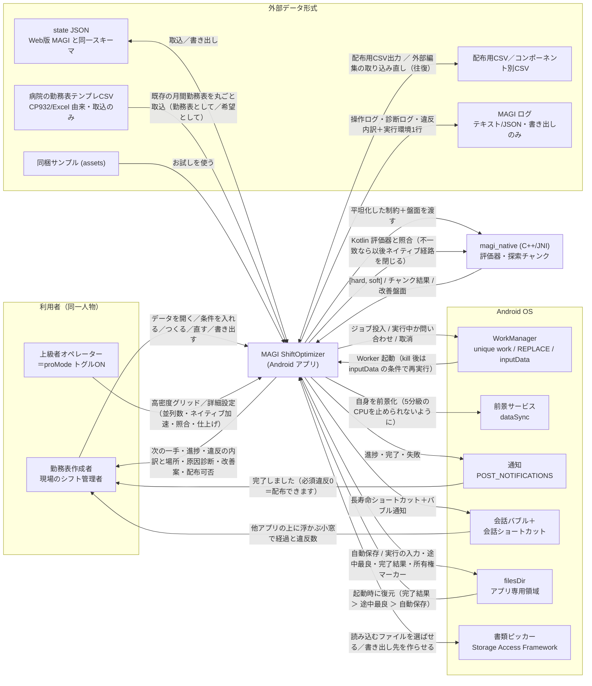
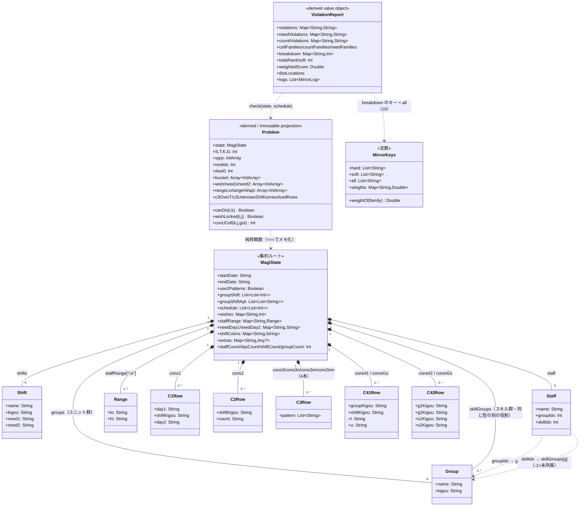

# SUDO モデル（システム関連図 / ユースケース図 / ドメインモデル図 / オブジェクト図）

> **最終更新**：2026-08-17（3.389.0 で新規作成）
> **これは何か**：ログラス松岡さん（@little_hand_s）提唱の **SUDO モデリング**（DDD のモデリングを実装へ落とし込む
> ための最小ラインナップ）を、このリポジトリの**実装から**起こしたもの。4図それぞれの役割は本家記事のとおり:
> **S**=システム関連図（登場人物と外部システム）／**U**=ユースケース図（利用者が何をするか）／
> **D**=ドメインモデル図（型と不変条件）／**O**=オブジェクト図（実データ1件を具体値で埋めた例）。

## この文書の立ち位置（読む前に）

- **実装が正**。この文書は `app/src/main` と `app/src/test/resources` を実際に読んで書いた。
  既存の `docs/*.md` と食い違うところは実装側を採り、末尾の「docs と実装の食い違い」に列挙した。
- **D と O は数値まで実測**。O の `ViolationReport` はホストJVM（kotlin-compiler-embeddable 2.0.21）で
  `UnifiedViolationChecker.check(state, state.schedule)` を実行して得た値で、推定値は1つも無い。
- **行番号は書かない**。参照はファイル名とシンボル名まで。作成中に `OptimizationWorker.kt` を編集した結果、
  収集時の行番号が最大 +26 ずれた（内容は正しいのに数字だけ古くなる）。**行番号は最も早く腐る**ので、
  この文書では最初から持たない方針にした。
- **この文書は設計の提案ではない**。既に動いているものの構造を写したもので、
  `docs/algorithm_portfolio.md` と同じ規律（書くのは実装済みの事実だけ）に従う。

---

## S — システム関連図

**アクターは実質1人**。「勤務表作成者」と「上級者オペレーター」は別の人物でも別権限でもなく、
`MagiApp.kt` の `proMode`（`rememberSaveable` な端末ごとの表示フラグ1つ）で切り替わる**同一人物のモード**。
`docs/power_user_ux.md` 自身が「状態・データ・エンジンは共通」と書いている。ログインも権限分離も存在しない。



**この図で読み取ってほしいこと**

| 関係 | なぜ重要か |
|---|---|
| `WorkManager` に **inputData を永続化して渡す** | プロセス kill 後の再実行でも予算秒数・並列数・runId が同じ＝実行条件が化けない（3.106.0）。 |
| `filesDir` の **所有権マーカー** | 固定ファイル名＋`REPLACE` なので、置き換えられた旧実行が新実行のファイルを消せる。`RunFiles.owns()` がこれを塞ぐ（3.327.0/3.388.0）。 |
| `magi_native` は**必ず Kotlin と照合される** | C++ は「高速版」であって正ではない。不一致なら `NativeGate` が閉じて Kotlin へ退避＝**誤った勤務表でなく速度低下**として現れる。 |
| ログの矢印が**片方向** | ログは書き出すだけで読み戻さない。診断はすべて実行時に作り直す。 |
| 文字化け修復は**元ファイルを書き換えない** | 取込時に復元するだけ。外部ツール／旧Web書き出し由来の二重エンコードに対する防御。 |

---

## U — ユースケース図

25 ユースケース。**「つくる」より「直す」「説明を読む」の方が多い**のがこのアプリの性格を表している。

```mermaid
flowchart TB
  A(("勤務表作成者"))

  subgraph G1["つくる・止める"]
    U1["勤務表をつくる"]
    U2["初期の下書きをつくる"]
    U3["計算をやめる"]
    U4["アプリを閉じても計算を続ける"]
    U5["仕上げに自動で整える"]
    U6["別の案に差し替える"]
  end

  subgraph G2["直す"]
    U7["違反をチェックする"]
    U8["割当を手で直す"]
    U9["違反の直し方を探して適用する"]
    U10["人手不足を対話で埋める"]
    U19["診断の指摘に沿って設定を直す"]
    U20["見直し候補をメモに残す"]
  end

  subgraph G3["今月の条件を入れる"]
    U11["希望シフトを登録する"]
    U12["希望を勤務表へ反映する"]
    U13["日別の必要人数を決める"]
    U14["対象の月を切り替える"]
  end

  subgraph G4["土台を決める（年間マスター）"]
    U15["職員を登録・変更する"]
    U16["シフト・グループ・担当可否を定義する"]
    U17["1人あたりの回数を決める"]
    U18["制約ルールを編集する"]
  end

  subgraph G5["出し入れ・調整"]
    U21["データを開く・新規につくる"]
    U22["CSVを取り込む"]
    U23["勤務表とデータを書き出す"]
    U24["取り消して元に戻す"]
    U25["計算と表示の条件を調整する"]
  end

  A --- U1 & U2 & U3 & U4 & U5 & U6
  A --- U7 & U8 & U9 & U10 & U19 & U20
  A --- U11 & U12 & U13 & U14
  A --- U15 & U16 & U17 & U18
  A --- U21 & U22 & U23 & U24 & U25

  U1 -.->|"includes"| U7
  U8 -.->|"includes"| U7
  U9 -.->|"includes"| U7
  U12 -.->|"includes"| U7
  U19 -.->|"includes"| U7
  U5 -.->|"includes"| U1
```



**入口（主要なものだけ・実際のボタン文言）**

| ユースケース | 入口 | 呼ぶもの |
|---|---|---|
| 勤務表をつくる | ホームの思考誘導カード「勤務表をつくる」／下部コマンドバー | `runV6FullOptimize` |
| 初期の下書きをつくる | ホームの補助ボタン「初期解を作る（希望・C1を優先した下書き）」 | `generateSmartInitial` |
| アプリを閉じても計算を続ける | 設定＞最適化設定「バックグラウンドでつくる（閉じても続行）」 | `OptimizationWorker` へ enqueue |
| 違反の直し方を探して適用する | 分析の要確認一覧・注意リスト／勤務表の集計セル →「直し方を探す」 | `findFixSuggestions` → `applyFixSuggestion` |
| 希望シフトを登録する | 編集＞月次条件の希望カレンダー →「N日に適用」 | `setWishesForDays` |
| 診断の指摘に沿って設定を直す | 設定ミスカードの修正ボタン／「この並びの禁止をやめる」／「下限を1下げる」 | `relaxForbiddenRule` / `relaxStaffRangePin` |
| データを開く・書き出す | 設定＞データ操作「データを開く」「データを保存」「CSV取込」「CSV出力」／コンポーネント別「職員」「希望」「制約」 | `loadAsync` / `exportJson` / `importCsvSmart` |
| 取り消して元に戻す | 下部コマンドバー「元に戻す」「やり直し」／設定「開く前のデータに戻す（もう一度押すと入れ替え）」 | `undo` / `redo` / `restorePreviousData` |

**`includes` の意味**：`違反をチェックする`（= `UnifiedViolationChecker.check`）は独立したユースケースであると同時に、
盤面か設定が動く**すべての操作の末尾で必ず走る**。「チェックし忘れた状態」が存在しないのがこのアプリの前提で、
`refreshCheck` を通らない編集経路を作ると診断と画面が食い違う。

---

## D — ドメインモデル図

**集約ルートは `MagiState` ただ1つ。** 根拠は4点:
1. **シリアライズ境界そのもの** — `extras: Map<String, Any?>` が「未モデル化の項目を逐語保持」＝往復の無損失化。
   未知フィールドまで抱えて往復するのは、これが永続化の単位だから。
2. **子に独立した ID が無い** — Shift/Group/Staff/Range/C\*Row はすべて識別子を持たず、位置 index（`i`/`j`/`k`/`g`）か
   `kigou` でしか同定できない＝ルートの外では意味を持たない。
3. **一括で置き換わる値意味論** — 全部 `data class`。編集は `applyStructure` / `mutateConstraints` を通って
   新インスタンスになり、Undo/Redo もこの単位。
4. **参照方向が一方向** — 子から親への参照が無い。



### なぜ `Problem` と `ViolationReport` を別集約にしないか

- `Problem` は自称からして `Immutable, index-resolved view of a MagiState ready for fast evaluation`。
  `ProblemCache` は state の**参照同一性（`===`）**でメモ化するので、別の state が来れば作り直され陳腐化しない。
  schedule に依存しないため**並列ワーカー間で共有読取して安全**。
- `ViolationReport` は「(MagiState, 盤面) の対に対する評価結果」。`MagiState` には保持されず毎回作られる。

### 型の規約（最も取り違えやすい点）

**「数値はすべて String」ではない。** String なのは**利用者が入力する設定値**だけで、理由は
**「未設定」と「0」を区別する必要がある**から（`""` と `"0"` は意味が違う）。

| 分類 | 型 | 該当 |
|---|---|---|
| 設定値（未設定を `""` で表す） | `String` | `Shift.need1/need2`・`Range.lo/hi`・`C1Row.day1/day2`・`C2Row.count`・`C41Row.l/u`・`groupShiftApt` の要素 |
| index・盤面・マスク・フラグ | `Int` / `Boolean` | `Staff.groupIdx`・`Staff.skillIdx`・`schedule`・`groupShift`・`wishes` の値・`use2Patterns` |

**JSON 側では設定値が数値でも文字列でもよい。** golden_state.json は実際に混在していて、
`staffRange["0,9"] = {"lo":1,"hi":1}`（数値）・`groupShiftApt[7] = [10,"",10,…]`（数値と空文字の混在）。
`StateParser.asStr` が `null`/`JSONObject.NULL` → `""`、`Int`/`Long`/`Double` → 十進表記へ正規化して
モデル側を String に揃える。**この正規化があるので「未設定」の表現は常に `""` の1通り**になる。

`Problem` へ解決するとき、未設定は型ごとの**番兵値**になる:

| 概念 | 生（String） | Problem（Int） |
|---|---|---|
| 必要数 need1/need2 | `""` | `-1` |
| 個人下限 rangeLo | `""` | `Int.MIN_VALUE` |
| 個人上限 rangeHi | `""` | `Int.MAX_VALUE` |
| 適切回数 apt | `""` | `-1` |
| 希望 wish | キー無し | `-1` |
| 群レンジ l / u | `""` | `0` / `Int.MAX_VALUE` |

`normalizeSchedule` は範囲外セルを **`-1`（センチネル＝不正な値）** へ写す。行が短ければ `0` で埋める。

### 不変条件（すべて実装から）

**19族と重み** — `breakdown` は `MirrorKeys.all` の19キーを 0 で初期化してから加算するのでキー数は常に19。
HARD 4族 = `groupViol` / `c3n` / `covU` / `pref`、SOFT 15族。

```
groupViol 10000 > pref 9000 > covU 8000 > c3n 7000 > low 90 > high 45
  > c3mn 15 = c1 15 > c3 3 > c3m 2
  > c2 = c41 = c42 = c41s = c42s = apt = fair = weekly = covO = 1.0
```

`weights` を `linkedMapOf` で持つのは**挿入順＝加算順を固定して Double の加算結果を不変に保つ**ため
（浮動小数の加算は非結合）。UI の重み表がこのマップをそのまま描画するので、ここに行を足すと画面に生キーが出る
（`aptLow`/`aptHigh` を入れず `weightOf` で apt の 1.0 へエイリアスしているのはこのため）。

- `weightedScore = Σ breakdown[key] × weights[key]`（小さいほど良い）
- `total = Σ breakdown.values`（重み無視の生カウント）／`hard = HARD 4族の合計`／`soft = total − hard`

**keep-best の比較順序** — `reportComparator` / `betterReport` の **hard → weightedScore → total** の辞書式。
単一ソースは `reportComparator` 1つで、`betterReport` も並べ替えもここへ委譲する。
**この3キーを手で書き写すと写した側だけ取り残される**（`V6LateOperators.gateW`・C1広域ビーム・
`AdaptiveEliteArchive`・「他の案」の並べ替えが順に取り残された履歴がある）。

**評価まわりの判定規則**

- **covU/covO は per-cell の OR**：両方定義なら小さい方、片方定義ならその値、どちらも未定義なら 0。
  `covU>0` と `covO>0` は同一セルで両立しない。被覆は**同日のみ**（夜勤の翌日繰越なし）。
- **c42/c42s のペア数**：`g1==g2 && s1==s2` のとき left と right が同一集合になるので `C(n,2)`
  （自己ペアと順序重複を除く）、それ以外は `n1*n2`。
- **c3 族の評価モデルは2通り**：非 forbidden かつ単一シフト連 → **run-deficit**（完成 run は罰しない）。
  それ以外（複数シフト連 / forbidden）→ **窓マッチ #fire**。
- **c1 には canDo ガード**がある。表示は違反窓ランの先頭1セルにアンカーするが `inc` は違反窓ごとに計上する
  ＝**表示件数と breakdown 件数が食い違うのはこのため**。
- **pref は実現可能な希望のみ**計上（`canDo(i,w) && s[i][j] != w`）。担当不可への希望は充足しようがないので
  対称除外し、`impossibleWishCount` として別に案内する。
- **`wishLocked(i,j) = wish>=0 && canDo(i,wish)`** — 実現不能な希望はロックしない（凍結すると座礁する）。
- **fair**：群 × 担当ONシフトごとに、メンバー回数の `round(平均)` からの L1 偏差和。**m<2 の群は対象外**。
- **weekly**：職員 × **シフト**ごとに、曜日別カウントの `round(そのシフトの回数/7)` からの L1 偏差和。
  回数が7の倍数でない (職員,シフト) は**構造的な下限**を持つ（`weeklyFloorOfCount`）。
- **apt** は群目標を個人 `staffRange[lo,hi]` でクランプし、担当可能シフトのみ展開する。
- **辞書式パック**：`score = hard × SCORE_HARD_UNIT + soft`。`soft < SCORE_HARD_UNIT`(1e9) を
  `Evaluator.fullEval` が強制する（超えると HARD ゲートが静かに壊れる）。
- **厳密ピン**：`rangeLo == rangeHi` は「回数固定」として扱われ、研磨は `exactPinRegression` でこれを崩す手を却下する。

**「休」の扱い** — 識別は**記号ベース**（`shifts.indexOfFirst { it.kigou == "休" } ?: 0`）で、
見つからないと**先頭シフトを黙って休として扱う**（検査 2g が警告する）。`Problem.restIdx` が単一ソース。
**休は「特殊な OFF」ではなく通常のシフト種の一つ**（3.345.0）。**編集規則も同じ**（3.416.0）＝
削除・改名とも他シフトと同一経路（旧: 3.106.0 の削除禁止と 3.415.0 の改名禁止は撤廃。削除セルは
削除後一覧の既定シフトへ・改名は `renameShiftInConstraints` が制約参照を追従させる）。
評価層（Evaluator/DeltaEvaluator/checker/C++ fullEvalParts・SaChunk）に `restIdx` の参照は**ゼロ**
（3.345.0 の per-shift weekly 化以降）。残るのは①**データ経路の既定値**（fill/park先＝構造的既定・
3.345.0 でユーザー合意のうえ維持）②**診断**＝休は「1日に何人休んでよいか」という席の概念を持たないため、
適切回数の検査（6-C）と下限合計の検査（A）は必要人数ではなく `restCapacity`（各職員が他シフトの個人下限を
満たしたうえで最大何日休めるかの合計）と比較する ③**表示**（`shortageFixCandidates` が「（休み）」を
併記し休の人を先頭へ並べる）。グリッドの休セル淡色化（3.99.0）は 3.417.0 で撤去済み。

**規模の上限** — 職員 **30名以内** / 期間 **31日以内**。超過は `SettingIssue` で警告するだけで**実行は止めない**。
**64日**が別の境界で、超えると `C3nBitScan` と C++ `SaChunk` の bitmask 経路がスカラー退避へ落ち探索が遅くなる。
`dayCount` は `endDate` からではなく **`schedule[0].size`** から導出される。

**解決できない制約行は無言で捨てない** — `Problem` は記号や数値が解決できない行を除外するが、
`c3OverT`（期間より長い連続パターン）／`c3UnknownShift`（未定義シフト記号）／`unresolvedRows`（cons1/2/41/42/41s/42s）の
3リストに理由つきで記録し、`V6SanityPort` が「この行は評価されていません」と案内する（3.309.0/3.320.0）。

**HF77（変更規律）** — 重みを変えるときは `MirrorKeys.weights` / `Evaluator.fullEvalParts` のリテラル /
`DeltaEvaluator` / `magi_native.cpp` の**4面を同時に**変える（Kotlin 側のずれは `ObjectiveParityTest`、
C++ 側は native-parity CI が捕まえる）。

---

## O — オブジェクト図

**素材**：`app/src/test/resources/golden_state.json`（実データ由来の fixture）。
**規模**：10職員 × 31日 × 10シフト × 10グループ（2025-12-01〜2025-12-31、`use2Patterns=true`）。
制約は cons1=2 / cons2=1 / cons3=1 / cons3n=8 / cons3m=2 / cons3mn=4 / cons41=0 / cons42=7。
希望 84件（**全件が担当可＝実現不能希望 0**）、staffRange 51件、needDay1/2 = 0、skillGroups/cons41s/cons42s = 0。
この規模は `V6WebGoldenParityTest.loadDataBitMatchesWeb` がそのままアサートしている。

**なぜ golden を選んだか**：実データ由来の fixture は2つある（もう1つは `sample_state_v6.json`＝
native-parity CI の2つ目の形状で、入力盤面 `hard=15`＝C++ の HARD 族パスを実データで exercise するために
3.362.0 で追加した）。**golden は `hard=0` に到達済み＝「配布できる盤面」の具体例**として O 図に向く。
`hard=15` の方はどの族がどう壊れているかの例としては良いが、19族が同時に発火して図が読めなくなる。

```mermaid
flowchart TB
  ST["<b>state : MagiState</b><br/>startDate=2025-12-01(月)<br/>endDate=2025-12-31(水)<br/>use2Patterns=true<br/>staffCount=10 dayCount=31<br/>shiftCount=10 groupCount=10<br/>skillGroupCount=0<br/>wishes=84件 staffRange=51件"]

  SH0["<b>shifts[0] : Shift</b><br/>name=休み kigou=休<br/>need1='' need2=''<br/>（席の概念なし・restIdx=0）"]
  SH2["<b>shifts[2] : Shift</b><br/>name=夜勤 kigou=Dﾃ<br/>need1=1 need2=1<br/>（毎日ちょうど1人）"]
  SH9["<b>shifts[9] : Shift</b><br/>name=有給 kigou=有<br/>need1='' need2=''"]

  G7["<b>groups[7] : Group</b><br/>name=桒澤 kigou=B<br/>（所属1名＝fair は m&lt;2 で対象外）"]
  S0["<b>staff[0] : Staff</b><br/>name=古泉 健一<br/>groupIdx=9 skillIdx=0(既定)"]
  S3["<b>staff[3] : Staff</b><br/>name=桒澤美幸<br/>groupIdx=7 skillIdx=0(既定)"]

  GS7["<b>groupShift[7]</b><br/>[1,0,0,0,0,0,0,0,1,1]<br/>群Bが担当できるのは 休/B4/有 の3種のみ"]
  GA7["<b>groupShiftApt[7]</b><br/>[10,'',10,'','','','','',1,'']<br/>休=10 Dﾃ=10 B4=1<br/>※Dﾃ目標10は担当不可なので実効せず"]

  R09["<b>staffRange['0,9'] : Range</b><br/>lo=1 hi=1<br/>古泉×有給をちょうど1回に固定<br/><b>= 厳密ピン</b>（実配置0回→vio-low）"]
  R38["<b>staffRange['3,8'] : Range</b><br/>lo=1 hi=23<br/>桒澤×B4。群目標1は[1,23]で<br/>クランプされ実効1（実配置20→vio-aptHigh）"]

  C10["<b>cons1[0] : C1Row</b><br/>day1=14 shiftKigou=休 day2=5<br/>任意の14日窓に休が5回以上"]
  C11["<b>cons1[1] : C1Row</b><br/>day1=14 shiftKigou=Dﾃ day2=2"]
  C20["<b>cons2[0] : C2Row</b><br/>shiftKigou=有 count=1<br/>（実測 breakdown c2=4）"]
  CN0["<b>cons3n[0] : C3Row</b><br/>pattern=[Dﾃ,B4,'','','']<br/>夜勤の翌日に日勤は禁止（HARD 7000）"]
  CM2["<b>cons3mn[2] : C3Row</b><br/>pattern=[Dﾃ,休,Dﾃ,'','']<br/>3連パターン（Hate・SOFT 15）"]
  C421["<b>cons42[1] : C42Row</b><br/>g1=吉 g2=古 s1=A4 s2=A4<br/>2群のA4が同じ日に併存不可"]

  W017["<b>wishes['0,17']</b> = 8<br/>古泉×12/18 に B4 を希望<br/>schedule[0][17]=8 ＝充足済み"]
  SC3["<b>schedule[3]</b>（桒澤美幸の1か月・31要素）<br/>[9,8,8,8,8,0,8,8,8,8,0,0,0,0,8,8,0,8,8,8,8,8,0,8,8,8,8,8,0,0,0]<br/>= 休10回 / B4 20回 / 有1回"]

  RP["<b>report : ViolationReport</b>（実測）<br/><b>hard=0 total=437 weightedScore=4999.0</b><br/>c1:115 weekly:183 c3:36 c3m:36 apt:28<br/>c3mn:11 low:8 c42:6 c2:4 covO:4 fair:4 high:2<br/>violations=116件 needViolations=4件 countViolations=15件"]

  ST --- SH0 & SH2 & SH9
  ST --- G7
  ST --- S0 & S3
  ST --- GS7 & GA7
  ST --- R09 & R38
  ST --- C10 & C11 & C20 & CN0 & CM2 & C421
  ST --- W017 & SC3
  S3 -.->|groupIdx=7| G7
  G7 -.-> GS7
  G7 -.-> GA7
  ST -.->|"check(state, schedule)"| RP
```



**この1件から読み取れること**

- **`hard=0` は「配布できる」を意味する**。golden は既に配布可の盤面で、残っているのは全部 SOFT。
  `weightedScore=4999` は `golden_eval_expected.txt` の `soft=4999` と一致する（3.409.24 で c1/c3mn の重みを
  15→30 にしたので 3109 から上がっている＝族の件数は1つも変わっていない）（`hard=0` なので
  `weightedScore == soft の重み付き和`）。これが **Kotlin↔C++ の言語跨ぎパリティの固定値**（3.357.0）。
- **担当可否が apt を無効化する具体例**：`groupShiftApt[7]` は Dﾃ に目標10 を持つが、`groupShift[7][2]=0`＝
  群Bは Dﾃ を担当できない。`Problem.apt` 構築時に `bucket=canDo` ガードが効くので、この目標は**実効しない**
  （到達不能な幻の apt 違反を作らないための設計）。
- **厳密ピンの実物**：`staffRange["0,9"]` が `lo==hi==1`。研磨パスはこれを崩す手を `exactPinRegression` で却下する。
  実配置は0回なので `vio-low`（重み90）が立っており、**ピンを守ることと違反が残ることは両立する**。
- **cons3n は全8行**、すべて Dﾃ / Cｵ / Cｱ の翌日に勤務シフトを置くことを禁止する（Dﾃ×5、Cｵ×2、Cｱ×1）。
  つまりこのデータの禁止連続は**夜勤・準夜勤の翌日**という単一の業務ルールを8行に展開したもの。
- **`needViolations` 4件はすべて `vio-covO`**：キーは `"2,8"` `"2,9"` `"2,21"` `"2,27"`＝
  被覆キー空間 `"k,j"` で shift 2（Dﾃ）が 12/9・12/10・12/22・12/28 に2人配置＝`need1=1` を超過。
  covU（人員不足）は0＝この盤面は「足りない」のではなく「多い日がある」。
  `countViolations` 15件の内訳は `vio-low` 8 / `vio-aptLow` 4 / `vio-high` 2 / `vio-aptHigh` 1。
- **cons41 は0件**なので、`C41Row` の具体インスタンスは golden から取得できない（`(未設定)` として扱う）。

---

## docs と実装の食い違い（実装を正とする）

作成中に見つかったもの。**この文書を書く目的の半分はこれの洗い出し**だった。

1. **`docs/data-models.md` §3「`schedule[i][j] < 0` ＝ 公休（未割当）」は誤り。**
   休は `kigou=="休"` で解決される**通常のシフト index**であって負値ではない。負値は `normalizeSchedule` が
   範囲外セルへ付ける**センチネル `-1`**で、意味は「不正な値」。`Problem.initialAssignment` も `k<0` を 0 へクランプする。
2. **`docs/data-models.md` は `Staff.skillIdx` を「`Int = 0`」としか書いていないが、実装では `-1`（未所属）が正規の値。**
   UI の「(なし)」がこれを設定し、`ssk[i]==groupIdx(>=0)` が常に偽になるので cons41s/cons42s から安全に外れる。
   群削除時の再割当も `-1` へ寄せる（3.328.0）。
3. **`docs/data-models.md` のヘッダが stale**（「最終更新 2026-06-30 / main commit `6769806` 時点」）。
   §1・§2 の MagiState フィールド表そのものは実装と完全一致だが、§3 のキー規約の注記と §4 の UiState 一覧が
   ドリフトしていた。**→ 3.390.0 で §4 を全82フィールドへ刷新**（旧記述は30フィールドが未記載＝`*Families` 3種・
   result 専用マップ7種・調整トグル4種・診断5種などが丸ごと落ちていた）。以後は各グループの**件数**を
   `MagiUiState.kt` の `val` 宣言数と機械照合できる形にしてある。
4. **`docs/business-logic.md` は重み・族数とも実装と一致**（19族・c1=15・c3mn=15・covO=1.0・c42 の C(n,2)・
   keep-best の hard→weightedScore→total）。ここは信用してよい。
5. **コード内コメントの stale が1件**：`MirrorKeys.weights` に「窓の要件(c1)=5」というコメントが残っており、
   次の行が「3.253.0 で 5→15 へ（上のコメントは 5 のままで実装とずれていた）」と自己訂正している。実装値は **15**。

## 図を描くときに取り違えやすい点

- **`C42Row(g1Kigou, g2Kigou, s1Kigou, s2Kigou)` と `C42(g1, s1, g2, s2)` はフィールド順が違う。**
- **`Group` は2つの役割で使い回される**（`groups`=ユニット群 / `skillGroups`=スキル群）。担当可否に効くのは
  `groups` だけで、`skillGroups` は cons41s/cons42s 専用。関連線を2本に分けること。
- **`C3Row` / `C41Row` / `C42Row` も複数のコレクションで使い回される**（C3Row は4本、C41Row/C42Row は各2本）。
  型は同じでも意味はコレクション名で決まる。
- **3つのキー空間**を混ぜない：セル `"i,j"`（violations, wishes）／回数 `"i,k"`（countViolations, staffRange）／
  被覆 `"k,j"`（needViolations, needDay1/2）。族ごとにどの空間へ載るかが決まっている。
- **`fair` と `weekly` はセル位置を持たない**ので `violations` には出ず、`distLocations` にのみ出る。
- **制約族の粒度**：c41/c41s は「1日の人数」、c2/apt/low/high は「月間の回数」。単位が違う。
- **盤面は二重の立場を持つ**：`MagiState.schedule`（保存された盤面）と、評価器へ引数で渡る
  `Array<IntArray>`（候補盤面）。図に描くなら分けたほうが誤解が少ない。
